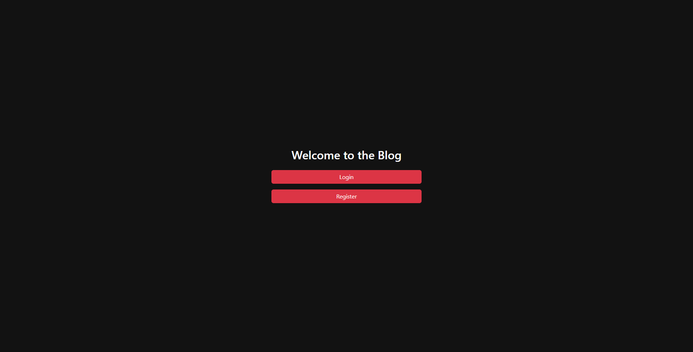

# Домашняя соц. сеть


__Основные принципы: Минимализм, Практичность, и Функциональность__

При создании данного проекта, стояла задача реализация следующего функционала:
- [ ] Общение, и публикация постов.
- [ ] Создание проектов, и занесение трудозатрат по задачам проекта.
- [ ] Wish List ( Список подарков для человека, чтобы было, и приятно, и полезно )
- [ ] Мобильное приложение, которое работает с REST API сайта.

### Установка
Клонирование проекта:
```shell
git clone https://github.com/KlimentFis/Home_Social_Network
```

Переход в папку проекта:
```shell
cd Home_Social_Network
```

Установка и активация виртуального окружения ( Не обязательно ):
```shell
python -m venv venv && venv\Scripts\activate.bat
```

Установка зависимостей:
```shell
pip install -r requirements.txt
```

Создание миграций:
```shell
python manage.py makemigrations
```

Проведение миграций:
```shell
python manage.py migrate
```

Создание Супер-пользователя ( Не обязательно ):
```shell
python manage.py createsuperuser
```

### Запуск проекта
Для локальной разработки:
```shell
python manage.py runserver
```
Для продакшена:
```shell
python manage.py runserver 0.0.0.0:8000
```

### Руководство по Rest API
Авто-документация:
- http://127.0.0.1:8000/swagger-docs/
- http://127.0.0.1:8000/redoc/